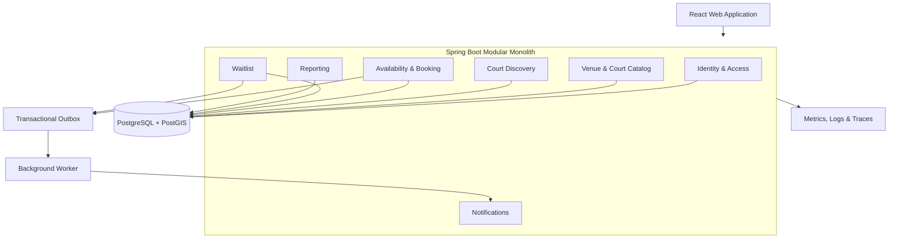

# Sport Booking Solution Architecture

This document is updated after each solution-architecture discussion. It distinguishes confirmed decisions from recommendations and unresolved questions.

## Context

- **Product:** Marketplace for discovering and booking badminton courts
- **Initial market:** Ho Chi Minh City, Vietnam
- **Current objective:** Learning project and portfolio-quality MVP
- **Budget:** Limited; prefer free and low-cost development and hosting options
- **MVP users:** Business owner and player
- **MVP priorities:** Scheduling and court discovery
- **Booking creation:** Both owners and players can create bookings
- **Waitlist:** Notify or offer released slots to interested players

## Architecture Direction

### Recommended structure

Use a modular monolith for the MVP. Keep domain modules separate inside one backend deployment so they can evolve without the operational cost of microservices.

Because the current goal is learning, favor an architecture that demonstrates sound design without requiring paid or operationally complex infrastructure.



### Domain modules

- **Identity and access:** Player and owner authentication and authorization
- **Venue and court catalog:** Businesses, venues, badminton courts, operating hours, and court information
- **Court discovery:** Search by location, date, time, and availability
- **Availability and booking:** Availability, conflict prevention, owner-created bookings, player-created bookings, cancellations, and rescheduling
- **Waitlist:** Interested players, ordering, released-slot offers, and offer expiration
- **Notifications:** Booking confirmations, cancellations, and waitlist offers
- **Reporting:** Basic booking, utilization, and revenue summaries

### Core domain relationships

```text
Owner → Venue → Court
Player → Booking → Court + Time Range
Court → Operating Hours / Unavailable Periods
Cancelled Booking → Waitlist Offer → Player
```

## Booking Consistency

PostgreSQL must be the source of truth for booking conflicts. Create bookings inside database transactions and enforce a database-level constraint that prevents overlapping active time ranges for the same court.

Application-level availability checks alone are insufficient because an owner and player could attempt to reserve the same slot concurrently.

## Technology Direction

### Recommended for the MVP

- React for the responsive player and owner web interfaces
- Spring Boot for the modular backend
- PostgreSQL as the transactional source of truth
- PostGIS for nearby-court discovery
- A scheduled background job in the Spring Boot application for initial waitlist processing
- Docker Compose for local development
- GitHub for source control and CI/CD
- Local development as the default; deploy only when a shareable demo is needed

### Add when operationally justified

- A separate background worker
- A transactional outbox
- Prometheus for metrics
- Grafana for dashboards
- Distributed tracing

### Deferred

- **Kafka:** Start with a transactional outbox and background worker. Introduce a message broker when event volume or independent consumers justify it.
- **Kubernetes:** Avoid for the MVP unless an existing organizational platform already operates and supports it.
- **Microservices:** Keep domain boundaries inside the modular monolith and extract services only in response to demonstrated scaling or ownership needs.
- **Paid notification providers:** Use in-app or development-only notifications until external delivery is needed for a demo.
- **Native mobile applications:** Build a responsive web interface first.

## Cost-Conscious Development Topology

Run the learning version locally with only:

```text
React application
        ↓
Spring Boot application
        ↓
PostgreSQL/PostGIS
```

Do not require Kafka, Kubernetes, Redis, a separate worker, or a full observability stack. These technologies may be studied later as optional exercises, but they should not block completion of the booking workflow.

## Design Patterns

Use patterns selectively at the point where they protect a business rule or make likely change easier.

### Primary architecture pattern: modular monolith

Organize the Spring Boot application by business capability rather than by technical layer:

```text
booking/
court/
venue/
discovery/
waitlist/
identity/
reporting/
```

Each module may contain its own API, application service, domain model, and persistence adapter. Modules must communicate through explicit public interfaces rather than reaching into one another's internal classes.

### Lightweight domain-driven design

Use domain language consistently and place important rules in domain objects or domain services.

Suggested aggregates:

- `Venue` owns venue information and courts
- `Booking` owns its lifecycle and status transitions
- `WaitlistEntry` or `WaitlistOffer` owns waitlist participation and offer expiration

Keep `Court` identity explicit. Enforce cross-booking overlap protection in PostgreSQL because a single in-memory aggregate cannot safely prevent concurrent bookings.

### Hexagonal boundaries

Keep core booking use cases independent from Spring MVC and database implementation details.

```text
Controller → Application use case → Domain
                                  ↓
                           Repository port
                                  ↓
                         PostgreSQL adapter
```

Apply this primarily to the booking module as a learning exercise. Other simple CRUD modules may use a conventional controller-service-repository structure.

### Repository pattern

Expose domain-oriented persistence operations, for example:

- Find a court
- Find bookings for a court and time range
- Save a booking
- Find the next eligible waitlist entries

Do not expose one generic repository abstraction for every entity.

### State machine for booking lifecycle

Represent lifecycle changes explicitly:

```text
PENDING → CONFIRMED → COMPLETED
    │          │
    └──────────┴→ CANCELLED

CONFIRMED → NO_SHOW
```

Only allow valid transitions. The exact states can be simplified until payment or temporary slot holds are introduced.

### Strategy pattern for changing policies

Use interchangeable policies only where rules are expected to vary:

- Cancellation policy
- Waitlist ordering policy
- Released-slot offer policy
- Future pricing policy

Start with one concrete implementation. Introduce an interface when a second implementation is needed or when isolating an unresolved rule improves testing.

### Specification pattern for discovery

Compose optional court-search criteria such as location, availability, date, time, and amenities. In Spring Data, implement this with JPA specifications or explicit query objects.

### Domain events

Publish in-process events after meaningful changes:

- `BookingConfirmed`
- `BookingCancelled`
- `WaitlistOfferCreated`

Handle notifications and simple reporting updates outside the main booking logic. Use in-process Spring events for the learning MVP. Add a transactional outbox only when reliable external delivery becomes necessary.

### Patterns to defer

- Microservices
- Event sourcing
- CQRS with separate databases
- Saga orchestration
- Generic booking engines
- Abstract factories for different business types
- Kafka-based event-driven architecture

These patterns add complexity without solving a current MVP requirement.

## Generic Booking Model Assessment

The proposed `Business Object → Sport Court / Cafe / Hotel` model is too generic for the current MVP. Cafes, hotels, and sports courts have materially different inventory and reservation rules.

Model the current domain explicitly with `Venue`, `BadmintonCourt`, `Availability`, and `Booking`. Do not add cafe and hotel abstractions now. Extract shared concepts such as `Resource`, `TimeRange`, or `Reservation` later only if real use cases demonstrate stable common behavior.

The proposed `Processing` component is also too broad. Replace it with explicit domain modules so ownership and business rules remain clear.

The term `Transaction` must not be used without qualification. Distinguish among:

- Database transaction
- Booking lifecycle operation
- Payment transaction

## Open Architecture Decisions

- Web-first versus native mobile applications
- Booking confirmation and temporary slot-hold behavior
- Waitlist ordering and released-slot claim rules
- Notification channels for Ho Chi Minh City users
- Hosting provider and deployment topology
- Authentication approach

## Operating Cost Estimate

Pricing checked on 2026-07-29. Provider prices and free-tier limits may change.

### Local learning environment: $0/month

- Run React, Spring Boot, and PostgreSQL/PostGIS locally.
- Use Docker Compose for the database and optional application containers.
- Use GitHub's free features for source control.
- Do not purchase a domain or external notification service.

This is the recommended starting point while implementing the core workflows.

### Public portfolio demo: $0/month

| Component | Suggested service | Estimated cost | Limitation |
|---|---|---:|---|
| React frontend | Cloudflare Pages Free | $0/month | Subject to free-plan limits |
| Spring Boot backend | Render Free or Koyeb Free | $0/month | Sleeps when idle and has a cold start |
| PostgreSQL/PostGIS | Neon Free | $0/month | 0.5 GB storage per project and compute scales to zero |
| Domain | Provider subdomain | $0/month | Branded custom domain not included |
| Notifications | In-app or logs | $0/month | No real SMS or Zalo delivery |
| **Total** |  | **$0/month** | Appropriate for learning and demonstrations only |

Cloudflare Pages provides free static asset hosting. Render's free web service sleeps after 15 minutes without inbound traffic and may take about one minute to wake. Koyeb's free instance provides 512 MB RAM and 0.1 vCPU and scales to zero after one hour. A Spring Boot application may require careful memory configuration on either free option.

Use Neon rather than Render's free PostgreSQL for durable demos because Render's free database expires after 30 days. Neon Free currently includes 0.5 GB storage per project, 100 CU-hours per month, scale-to-zero, and access to extensions including PostGIS.

### Low-cost always-on demo: approximately $5–10/month

- Keep the frontend on Cloudflare Pages Free.
- Use a small paid backend instance. Koyeb lists a 1 GB `eco-small` instance at $5.36/month; 1 GB is safer for Spring Boot than a 512 MB free instance.
- Keep PostgreSQL on Neon Free while the data and usage remain within its limits.
- Continue using a provider subdomain.

This removes the backend cold start but the free database may still suspend when idle.

### Costs intentionally excluded

- Optional custom domain, commonly an annual rather than monthly expense
- SMS, Zalo, email, or push-notification delivery
- Online payment processing fees
- Map and geocoding usage beyond free allowances
- Production backups, uptime guarantees, monitoring, and support
- Taxes and currency-conversion charges

### Cost decision

Start locally at $0/month. Deploy to free services only when a shareable portfolio demo is useful. Do not pay for always-on infrastructure until cold starts interfere with demonstrations or real users begin testing the system.

### Pricing references

- [Cloudflare Pages pricing](https://developers.cloudflare.com/pages/functions/pricing/)
- [Render free services](https://render.com/docs/free)
- [Koyeb instance pricing](https://www.koyeb.com/docs/reference/instances)
- [Neon pricing](https://neon.com/pricing)
